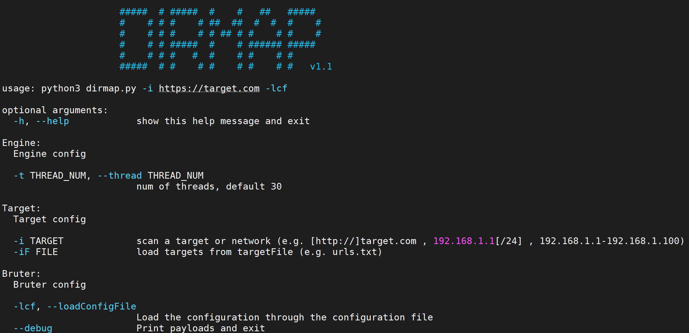

# dirmap

一个高级web目录扫描工具，功能将会强于DirBuster、Dirsearch、cansina、御剑



# 需求分析

经过大量调研，总结一个优秀的web目录扫描工具至少具备以下功能：

- 并发引擎
- 能使用字典
- 能纯爆破
- 能爬取页面动态生成字典
- 能fuzz扫描
- 自定义请求
- 自定义响应结果处理...

那么接下来看看dirmap的**特点**吧

# 功能特点

1. 支持n个target\*n个payload并发
2. 支持递归扫描
3. 支持自定义需要递归扫描的状态码
4. 支持(单|多)字典扫描
5. 支持自定义字符集爆破
6. 支持爬虫动态字典扫描
7. 支持自定义标签fuzz目标url
8. 自定义请求User-Agent
9. 自定义请求随机延时
10. 自定义请求超时时间
11. 自定义请求代理
12. 自定义正则表达式匹配假性404页面
13. 自定义要处理的响应状态码
14. 自定义跳过大小为x的页面
15. 自定义显示content-type
16. 自定义显示页面大小
17. 按域名去重复保存结果

# 使用方法

## 环境准备

```shell
git clone https://github.com/H4ckForJob/dirmap.git && cd dirmap && python3 -m pip install -r requirement.txt
```

## 快速使用

### 单个目标

```shell
python3 dirmap.py -iU https://target.com -lcf
```

### 多个目标

```shell
python3 dirmap.py -iF urls.txt -lcf
```

### 结果保存

1. 结果将自动保存在项目根目录下的`output`文件夹中
2. 每一个目标生成一个txt，命名格式为`目标域名.txt`
3. 结果自动去重复，不用担心产生大量冗余

## 高级使用

自定义dirmap配置，开始探索dirmap高级功能

暂时采用加载配置文件的方式进行详细配置，**不支持使用命令行参数进行详细配置**！

编辑项目根目录下的`dirmap.conf`，进行配置

`dirmap.conf`配置详解

```
#递归扫描处理配置
[RecursiveScan]
#是否开启递归扫描:关闭:0;开启:1
conf.recursive_scan = 0
#遇到这些状态码，开启递归扫描。默认配置[301,403]
conf.recursive_status_code = [301,403]
#设置排除扫描的目录。默认配置空。其他配置：e.g:['/test1','/test2']
#conf.exclude_subdirs = ['/test1','/test2']
conf.exclude_subdirs = ""

#扫描模式处理配置(4个模式，1次只能选择1个)
[ScanModeHandler]
#字典模式:关闭:0;单字典:1;多字典:2
conf.dict_mode = 1
#单字典模式的路径
conf.dict_mode_load_single_dict = "dict_mode_dict.txt"
#多字典模式的路径，默认配置dictmult
conf.dict_mode_load_mult_dict = "dictmult"
#爆破模式:关闭:0;开启:1
conf.blast_mode = 0
#生成字典最小长度。默认配置3
conf.blast_mode_min = 3
#生成字典最大长度。默认配置3
conf.blast_mode_max = 3
#默认字符集:a-z。暂未使用。
conf.blast_mode_az = "abcdefghijklmnopqrstuvwxyz"
#默认字符集:0-9。暂未使用。
conf.blast_mode_num = "0123456789"
#自定义字符集。默认配置"abc"。使用abc构造字典
conf.blast_mode_custom_charset = "abc"
#自定义继续字符集。默认配置空。
conf.blast_mode_resume_charset = ""
#爬虫模式:关闭:0;开启:1
conf.crawl_mode = 0
#解析robots.txt文件。暂未实现。
conf.crawl_mode_parse_robots = 0
#解析html页面的xpath表达式
conf.crawl_mode_parse_html = "//*/@href | //*/@src | //form/@action"
#是否进行动态爬虫字典生成:关闭:0;开启:1
conf.crawl_mode_dynamic_fuzz = 0
#Fuzz模式:关闭:0;单字典:1;多字典:2
conf.fuzz_mode = 0
#单字典模式的路径。
conf.fuzz_mode_load_single_dict = "fuzz_mode_dir.txt"
#多字典模式的路径。默认配置:fuzzmult
conf.fuzz_mode_load_mult_dict = "fuzzmult"
#设置fuzz标签。默认配置{dir}。使用{dir}标签当成字典插入点，将http://target.com/{dir}.php替换成http://target.com/字典中的每一行.php。其他配置：e.g:{dir};{ext}
#conf.fuzz_mode_label = "{ext}"
conf.fuzz_mode_label = "{dir}"

#处理payload配置。暂未实现。
[PayloadHandler]

#处理请求配置
[RequestHandler]
#自定义请求头。默认配置空。其他配置：e.g:test1=test1,test2=test2
#conf.request_headers = "test1=test1,test2=test2"
conf.request_headers = ""
#自定义请求User-Agent。默认配置chrome的ua。
conf.request_header_ua = "Mozilla/5.0 (Windows NT 10.0; Win64; x64) AppleWebKit/537.36 (KHTML, like Gecko) Chrome/69.0.3497.100 Safari/537.36"
#自定义请求cookie。默认配置空，不设置cookie。其他配置e.g:cookie1=cookie1; cookie2=cookie2;
#conf.request_header_cookie = "cookie1=cookie1; cookie2=cookie2"
conf.request_header_cookie = ""
#自定义401认证。暂未实现。因为自定义请求头功能可满足该需求(懒XD)
conf.request_header_401_auth = ""
#自定义请求方法。默认配置get方法。其他配置：e.g:get;head
#conf.request_method = "head"
conf.request_method = "get"
#自定义每个请求超时时间。默认配置3秒。
conf.request_timeout = 3
#随机延迟(0-x)秒发送请求。参数必须是整数。默认配置0秒，无延迟。
conf.request_delay = 0
#自定义单个目标，请求协程线程数。默认配置30线程
conf.request_limit = 30
#自定义最大重试次数。暂未实现。
conf.request_max_retries = 1
#设置持久连接。是否使用session()。暂未实现。
conf.request_persistent_connect = 0
#302重定向。默认False，不重定向。其他配置：e.g:True;False
conf.redirection_302 = False
#payload后添加后缀。默认空，扫描时，不添加后缀。其他配置：e.g:txt;php;asp;jsp
#conf.file_extension = "txt"
conf.file_extension = ""

#处理响应配置
[ResponseHandler]
#设置要记录的响应状态。默认配置[200]，记录200状态码。其他配置：e.g:[200,403,301]
#conf.response_status_code = [200,403,301]
conf.response_status_code = [200]
#是否记录content-type响应头。默认配置1记录
#conf.response_header_content_type = 0
conf.response_header_content_type = 1
#是否记录页面大小。默认配置1记录
#conf.response_size = 0
conf.response_size = 1
#自定义匹配404页面正则
#conf.custom_404_page = "fake 404"
conf.custom_404_page = ""
#自定义匹配503页面正则。暂未实现。感觉用不着，可能要废弃。
#conf.custom_503_page = "page 503"
conf.custom_503_page = ""
#自定义正则表达式，匹配页面内容
#conf.custom_response_page = "([0-9]){3}([a-z]){3}test"
conf.custom_response_page = ""
#跳过显示页面大小为x的页面，若不设置，请配置成"None"，默认配置“None”。其他大小配置参考e.g:None;0b;1k;1m
#conf.skip_size = "0b"
conf.skip_size = "None"

#代理选项
[ProxyHandler]
#代理配置。默认设置“None”，不开启代理。其他配置e.g:{"http":"http://127.0.0.1:8080","https":"https://127.0.0.1:8080"}
#conf.proxy_server = {"http":"http://127.0.0.1:8080","https":"https://127.0.0.1:8080"}
conf.proxy_server = None

#Debug选项
[DebugMode]
#打印payloads并退出
conf.debug = 0

#update选项
[CheckUpdate]
#github获取更新。暂未实现。
conf.update = 0
```

# TODO

- [x] 命令行参数解析全局初始化
- [x] engine初始化
  - [x] 设置线程数
- [x] target初始化
  - [x] 单个url(-iU,inputUrl)
  - [x] 多个url(-iL,inputLocalFile)
  - [x] ip范围
    - [x] Start-End(-iR)
    - [x] IP/MASK(-iN)
- [ ] bruter初始化
  - [ ] 加载配置方式()
    - [ ] 读取命令行参数值
    - [x] 读取配置文件(-lcf,loadConfigFile)
  - [x] 递归模式选项(RecursiveScan)
    - [x] 递归扫描(-rs,recursive_scan)
    - [x] 需要递归的状态码(-rd,recursive_status_code)
    - [x] 排除某些目录(-es,exclude_subdirs)
  - [ ] 扫描模式选项(ScanModeHandler)
    - [x] 字典模式(-dm,dict_mode)
      - [x] 加载单个字典(-dmlsd,dict_mode_load_single_dict)
      - [x] 加载多个字典(-dmlmd,dict_mode_load_mult_dict)
    - [ ] 爆破模式(-bm,blast_mode)
      - [x] 爆破目录长度范围(必选)
        - [x] 最小长度(-bmmin,blast_mode_min)
        - [x] 最大长度(-bmmax,blast_mode_max)
      - [ ] 基于默认字符集
        - [ ] 基于a-z
        - [ ] 基于0-9
      - [x] 基于自定义字符集(-bmcc,blast_mode_custom_charset)
      - [x] 断点续生成payload(-bmrc,blast_mode_resume_charset)
    - [ ] 爬虫模式(-cm,crawl_mode)
      - [x] 自定义解析标签(-cmph,crawl_mode_parse_html)(a:href,img:src,form:action,script:src,iframe:src,div:src,frame:src,embed:src)
      - [ ] 解析robots.txt(-cmpr,crawl_mode_parse_robots)
      - [x] 爬虫类动态fuzz扫描(-cmdf,crawl_mode_dynamic_fuzz)
    - [x] fuzz模式(-fm,fuzz_mode)
      - [x] fuzz单个字典(-fmlsd,fuzz_mode_load_single_dict)
      - [x] fuzz多个字典(-fmlmd,fuzz_mode_load_mult_dict)
      - [x] fuzz标签(-fml,fuzz_mode_label)
  - [ ] 请求优化选项(RequestHandler)
    - [x] 自定义请求超时(-rt,request_timeout)
    - [x] 自定义请求延时(-rd,request_delay)
    - [x] 限制单个目标主机协程数扫描(-rl,request_limit)
    - [ ] 限制重试次数(-rmr,request_max_retries)
    - [ ] http持久连接(-rpc,request_persistent_connect)
    - [x] 自定义请求方法(-rm,request_method)(get、head)
    - [x] 302状态处理(-r3,redirection_302)(是否重定向)
    - [x] 自定义header
      - [x] 自定义其他header(-rh,request_headers)(解决需要401认证)
      - [x] 自定义ua(-rhua,request_header_ua)
      - [x] 自定义cookie(-rhc,request_header_cookie)
  - [ ] 字典处理选项(PayloadHandler)
    - [ ] 字典处理(payload修改-去斜杠)
    - [ ] 字典处理(payload修改-首字符加斜杠)
    - [ ] 字典处理(payload修改-单词首字母大写)
    - [ ] 字典处理(payload修改-去扩展)
    - [ ] 字典处理(payload修改-去除非字母数字)
  - [ ] 响应结果处理模块(ResponseHandler)
    - [x] 跳过大小为x字节的文件(-ss,skip_size)
    - [x] 自定义404页面(-c4p,custom_404_page)
    - [ ] 自定义503页面(-c5p,custom_503_page)
    - [ ] 自定义正则匹配响应内容并进行某种操作
      - [x] 自定义正则匹配响应(-crp,custom_response_page)
      - [ ] 某种操作(暂时未定义)
    - [x] 输出结果为自定义状态码(-rsc,response_status_code)
    - [x] 输出payload为完整路径(默认输出完成url)
    - [x] 输出结果展示content-type
    - [x] 自动去重复保存结果
  - [ ] 状态处理模块(StatusHandler)
    - [ ] 状态显示(等待开始、进行中、暂停中、异常、完成)
    - [x] 进度显示
    - [ ] 状态控制(开始、暂停、继续、停止)
    - [ ] 续扫模块(暂未配置)
    - [ ] 断点续扫
    - [ ] 选行续扫
  - [ ] 日志记录模块(ScanLogHandler)
    - [ ] 扫描日志
    - [ ] 错误日志
  - [ ] 代理模块(ProxyHandler)
    - [x] 单个代理(-ps,proxy_server)
    - [ ] 代理池
  - [x] 调试模式选项(DebugMode)
    - [x] debug(--debug)
  - [ ] 检查更新选项(CheckUpdate)
    - [ ] update(--update)

# 默认字典文件

字典文件存放在项目根目录中的`data`文件夹中

1. dict_mode_dict.txt       “字典模式”字典，使用dirsearch默认字典
2. crawl_mode_suffix.txt    “爬虫模式”字典，使用FileSensor默认字典
3. fuzz_mode_dir.txt        “fuzz模式”字典，使用DirBuster默认字典
4. fuzz_mode_ext.txt        “fuzz模式”字典，使用常见后缀制作的字典
5. dictmult                 该目录为“字典模式”默认多字典文件夹，包含：BAK.min.txt(备份文件小字典)，BAK.txt(备份文件大字典)，LEAKS.txt(信息泄露文件字典)
6. fuzzmult                 该目录为“fuzz模式”默认多字典文件夹，包含：fuzz_mode_dir.txt(默认目录字典)，fuzz_mode_ext.txt(默认后缀字典)

# 已知缺陷

1. “爬虫模式”只爬取了目标的当前页面，用于生成动态字典。项目将来会将“爬虫模块”与“生成动态字典功能”分离。
2. 关于bruter.py第517行`bar.log.start()`出错。解决方案：请安装progressbar2。卸载progressbar。防止导入同名模块。感谢某位表哥提醒。

```shell
执行命令：
python3 -m pip uninstall progressbar
python3 -m pip install progressbar2
```

# 维护工作

1. 若使用过程中出现问题，欢迎发issue
2. 本项目正在维护，未来将会有新的功能加入，具体参照“TODO”列表，未打勾项

# 致谢声明

dirmap在编写过程中，借鉴了大量的优秀开源项目的模式与思想，特此说明并表示感谢。

- [Sqlmap](https://github.com/sqlmapproject/sqlmap)
- [POC-T](https://github.com/Xyntax/POC-T)
- [Saucerframe](https://github.com/saucer-man/saucerframe)
- [gwhatweb](https://github.com/boy-hack/gwhatweb)
- [dirsearch](https://github.com/maurosoria/dirsearch)
- [cansina](https://github.com/deibit/cansina)
- [weakfilescan](https://github.com/ring04h/weakfilescan)
- [FileSensor](https://github.com/Xyntax/FileSensor)
- [BBscan](https://github.com/lijiejie/BBScan)
- [werdy](https://github.com/derv82/werdy)

# 联系作者

mail: xxlin.ujs@qq.com

